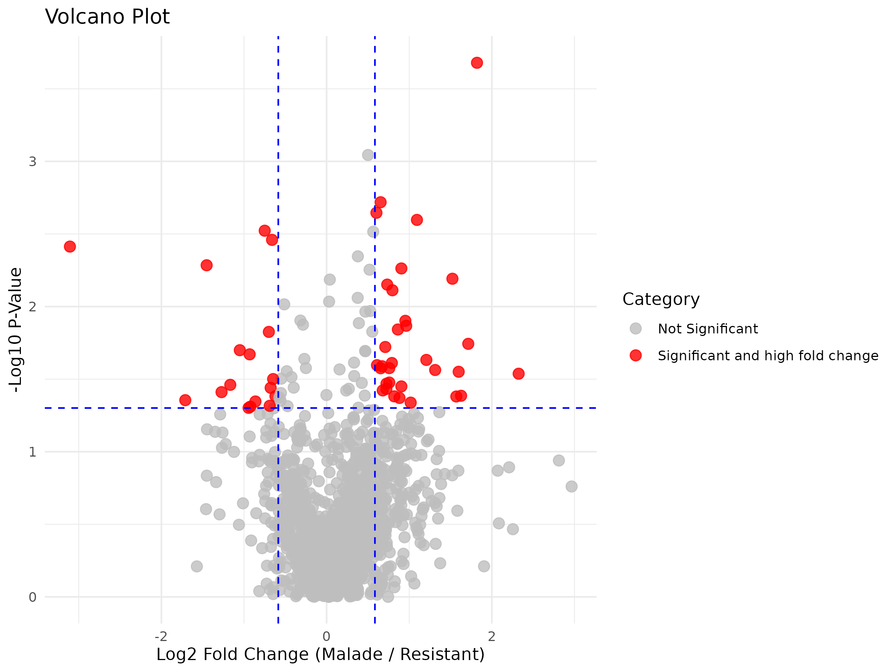
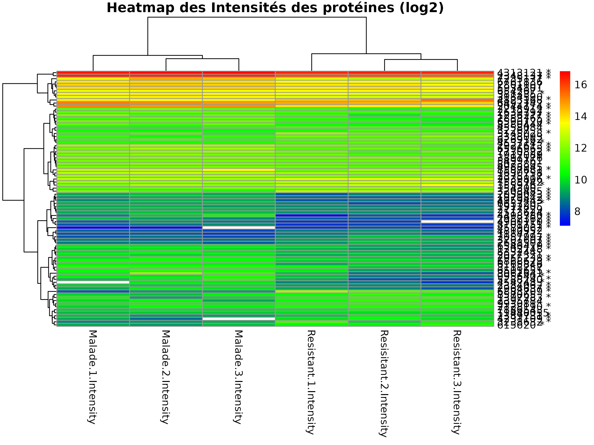

# Notre projet
La palourde japonaise _Ruditapes philippinarum_ représente une espèce clé de l’aquaculture mondiale, contribuant à 25 % de la production de mollusques. En France, elle a été introduite dans les années 1970 pour ses qualités remarquables : fécondité élevée, croissance rapide ou encore résistance aux maladies. Toutefois, cette espèce a subi un déclin significatif en Europe entre 2000 et 2015 en raison de deux pathogènes, dont _Vibrio tapetis_. Comprendre les réponses métaboliques de la palourde face à ce pathogène, en particulier les mécanismes de résistance, est essentiel pour élaborer des stratégies de gestion durable et limiter les épidémies.

# Objectif 
Une étude publiée en 2020 [Smits et al. 2020](./Smits_et_al_2020.pdf) a consisté à comparer différents profils protéomiques de palourdes japonaises exposées à _Vibrio tapetis_. A l'issue de quatres semaines d'expérimentation, des palourdes ont été classées comme infectées lorsque les diagnostics visuel et par PCR étaient positifs, et résistantes lorsque les diagnostics visuel et par PCR étaient négatifs. Les profils protéomiques des palourdes ont été comparés selon leur diagnostic.
Le présent projet vise à rendre plus FAIR cette étude qui n'est plus reproductible avec les nouvelles versions du logiciel PERSEUS utilisé par l'auteure, à actualiser les résultats sur la base des dernières données protéomiques disponibles et à proposer d'éventuelles améliorations quant au choix des méthodes d'analyse (ex : choix des tests statistiques). 

# Analyses
Les données sont tirées de l'article [Smits et al. 2020](./Smits_et_al_2020.pdf). Elles ne sont pas en libre accès et ont été fournies par l'auteure. Pour le bon fonctionnement des analyses à suivre, les fichiers suivants doivent être récupérés auprès de l'auteure et placés dans le dossier "input":
1_  "proteins.csv", qui contient la liste des protéines détectées chez les individus de palourde
2_  "Reads.fa", qui contient les séquences nucléotidiques qui codent pour toutes les protéines mentionnées dans le fichier "proteins.csv"
L'ensemble du code utilisé pour l'analyse a été réalisé sur le logiciel R dans sa version V4.4.1. 

## Sélectionner les protéines pertinentes pour la comparaison des palourdes infectées et résistantes
La sélection des protéines pertinentes pour la comparaison des palourdes infectées et résistantes s'est basée sur deux critères : des abondances significativement différentes entre les palourdes malades et résistantes, et un ratio d'au moins 1.5 entre les abondances des deux traitements. Cette sélection a été réalisée conformément à la publication initiale, c'est à dire en utilisant les critères du logiciel PERSEUS. Voir le [Notebook 1](./1_selection_proteines.ipynb) pour plus de détails sur les analyses statistiques. 

## Déterminer la fonction des protéines sélectionnées
Les fichiers Reads.fa et proteins_of_interest.csv ont été croisés pour obtenir un fichier final_49_seq.fa qui liste les séquences nucléotidiques codant pour les protéines sélectionnées suite à l'analyse du notebook 1. Ce fichier est ensuite soumis à la base de données NCBI pour assignation protéique. Voir le [Notebook 2](./2_proteines_vers_fasta.ipynb) pour plus de détails sur la méthode et l'assignation d'une fonction aux protéines qui expliquaient les différences entre les profils protéomiques des palourdes infectées et résistantes.

# Résultats
Nos résultats sont similaires à ceux de l'étude initiale. Le notebook 1 permet de retrouver les 102 protéines dont les abondances sont significativement différentes entre les palourdes malades et les résistantes, ainsi que les 49 protéines dont le ratio des abondances entre les deux phénotypes (FC dans l’article initial) est supérieur à 1.5. Ces 49 protéines sont décrites dans le tableau 2 de l'article [Smits et al. 2020](./Smits_et_al_2020.pdf). Le notebook 1 permet aussi de produire les graphiques ci-dessous. La figure 1 permet de visualiser les 49 protéines d’intérêt en fonction de leur p-value obtenue avec le t-test, et leur ratio (FC). La figure 2 permet de visualiser l’abondance des 102 protéines chez chaque réplicat. 

Le notebook 2 permet de réaliser l’assignation protéique. La liste des assignations a été comparée aux assignations obtenues dans l’article initial (voir tableau 2). 12 différences ont été relevées et pourraient faire l’objet d’analyses supplémentaires.

# Méthode alternative
Le [Notebook 3](./3_alternative_selection_proteines.ipynb) a été fourni dans le but d'améliorer la méthode d'analyse statistique appliquée par PERSEUS lors des comparaison de moyennes d'intensité de protéines au sein de chaque groupe. Ce notebook est similaire au [Notebook 1](./1_selection_proteines.ipynb) en tout point, sauf que les conditions d'application sont vérifiées, tandis que PERSEUS les considère vérifées par défaut. Avec notre méthode alternative, la normalité de la distribution des résidus est vérifiée avec le test de Shapiro-Wilk, et l'homoscédasticité avec le test de Levene. Le test des comparaisons de moyenne approprié dans chaque cas est retenu. Ce notebook conduit à la création d'une seconde liste de protéines disponible dans le fichier [alt_proteins.csv](input/alt_proteins.csv). 
Attention : explorer la fonction des protéines ainsi sélectionnées oblige à modifier en conséquence le fichier importé dans le [Notebook 2](./2_proteines_vers_fasta.ipynb). Egalement, la conduite de test statistiques est recommandée à partir d'un grand nombre de réplicats (pour un test non-paramétrique, le nombre de réplicat minimum est de 5). Si le nombre de réplicat est faible, il est recommandé de se restreindre à des analyses descriptives.  

# Is it FAIR ?
Les données d'entrée de l'étude n'étant toujours pas publiques, ce projet ne peut pas encore être considéré comme totalement FAIR. Néanmoins, le logiciel utilisé (R) permet le partage du code utilisé pour l'analyse et garantit ainsi la transparence sur les méthodes employées pour aboutir aux résultats. De plus, le code ici fourni permettra d'actualiser facilement l'étude sur la base des futures données disponibles, notamment concernant les assignations protéiques. 

## Attention
Trois des 49 loci dans le fichier final "cleaned_query_description" sont différents des 49 loci dans l'article de [Smits et al. 2020](./Smits_et_al_2020.pdf) (tableau 2). Cela est lié à la présence de doublons dans le fichier original "proteins.csv" à récupérer auprès de l'auteure. Au vu de ces trois différences, il semble que les codes proposés ici ont une méthode différente de PERSEUS pour sélectionner le doublon à conserver. Ces doublons présentent néanmoins les mêmes caractéristiques, à l'exception du locus assigné et le poids moyen. De plus, ils renvoient bien à une séquence nucléotidique identique, et donc vers la même fonction de protéine assignée par NCBI. Nous estimons ainsi que quel que soit le doublon éliminé, les conclusions demeurent identiques. 
